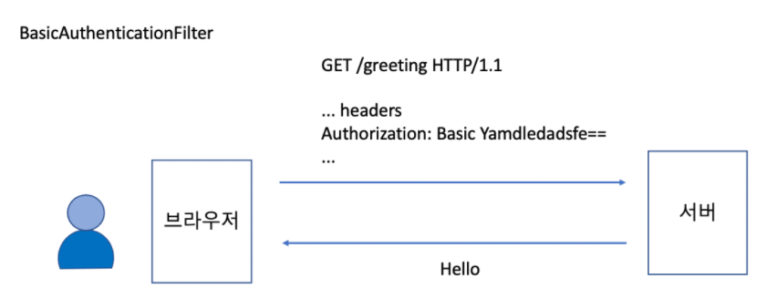
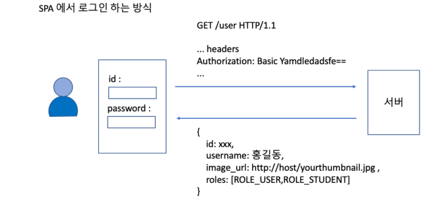

# study-security-basic-authentication

## 프로젝트 설정
- 프로젝트 선택
    - Project : Gradle Project
    - Language : Java
    - Spring Boot : 2.6.x
- Project Metadata
    - Group : study.security
    - Artifact : basic-authentication
    - Package name : study.security.basicauthentication
    - Packaging : Jar
    - Java : 11

## 내용

### BasicAuthenticationFilter 
- 로그인 페이지를 사용할 수 없을때 (react, vue, angular 등)
- 설정 방법(springboot version : 2.6.x)
```text
    public class SecurityConfig extends WebSecurityConfigurerAdapter {
        
        @Override
        protected void configure(HttpSecurity http) throws Exception {
            http.httpBasic();
        }
    }
```

- SecurityContext에 인증된 토큰이 없다면 아래와 같은 포멧의 토큰을 받아서 인증처리한다.

- http에서는 header에 username:password 값이 묻어서 가기 때문에 보안에 매우 취약하다. 그리서 반드시 https 프로토콜에서 사용할 것을 궎장한다.
- 최초 로그인시에만 인증을 처리하고, 이후에는 session에 의존한다.
- RememberMe를 설정한 경우, remember-me 쿠키가 브라우저에 저장되기 때문에 세션이 만료된 이후라도 브라우저 기반의 앱에서는 장시간 서비스를 로그인 페이지를 거치지 않고 이용할 수 있다.
- 에러가 나면 401(UnAuthrized) 에러를 보낸다.
- 로그인 페이지 처리는 주로 아래와 같은 방식으로 한다.


### SecurityContextPersistenceFilter
- SecurityContext를 저장하고 있는 저장소에서 만료되지 않은 인증이 있으면 SecurityContextHolder네 넣어준다.
- 이전에는 HttpSessionContextIntegrationFilter라는게 있었는데, 저장소가 반드시 세션일 필요는 없기 때문에 추상화된 객체로 발전된 필터이다.
- HttpSessionSecurityContextRepository : 서버 세션에 SecurityContext를 저장하는 기본 저장소이다.

### Bearer 토큰
- JWT 토큰
- Opaque 토큰

[[이전으로]](https://github.com/heechul90/study-security-custom-login) [[다음으로]](https://github.com/heechul90/study-security-multi-chain-proxy)

[[복습하기//적용하기]](https://github.com/heechul90/heech-member-server)